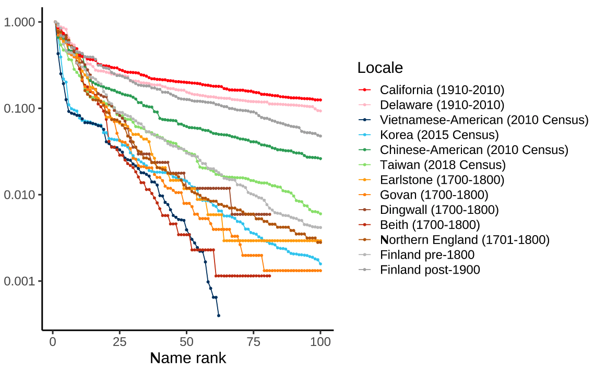

# Cross-cultural structures of personal name systems reflect general communicative principles
Michael Ramscar, Sihan Chen, Richard Futrell, Kyle Mahowald

This Github repository contains the data, the analysis script, and the figures in the paper.

## A description of the repository content
Note: as mentioned in the paper, we call the element in a personal that goes first *prefix-name* and the element that goes second *byname*. For example, in the name *John Smith*, *John* is the prefix-name and *Smith* is the byname. In the name *Li Xiaoping*, *Li* is the prefix-name and *Xiaoping* is the byname.

### Scripts
To reproduce all the main figures, download `finnish_data_selected.csv` from [here](https://drive.google.com/file/d/12peW30OdjllRnHIp3N5-hMDXJlEn59G8/view?usp=sharing), put the file inside the `Data` folder. Run `prediction1.R`, `top3_english.R`, `prediction2.R`, `prediction3.R` first, and then run `plot_merged_figs.R`. 

A description of the scripts:
- `prediction1.R`: code for the first analysis, generating Figure 5
- `prediction2.R`: code for the second analysis, generating Figure 3, Figure 6 and Figure 7
- `prediction3.R`: code for the third analysis
- `plot_merged_figs.R`: code to generate multi-panel figures (Figure 2 and Figure 4)
- `byname_analysis.R`: code to generate Figure 4a
- `supp_us_name_vs_population.R`: code to generate Figure 7
- `top3_english.R`: code for Figure 2b
- `make_chinese_names_from_US_census.R`: code to extract Chinese prefix-name data from the 2010 US Census
- `make_vietnamese_names_from_US_census.R`: code to extract Vietnamese prefix-name data from the 2010 US Census
- `supp_transcription.R`: code to compare the entropy calculated from the original data (containing name and spelling variations) with that from the pre-processed data (no such variations). See more details in Table 5 in Appendix A.1.1.s

### Data
This folder contains the data in our analysis.

#### American
- `US_census_all`: US baby name data, a dataset published by the Social Security Administration (SSA). The dataset is downloaded from [here](https://www.ssa.gov/oact/babynames/limits.html) (see `State-specific data`). The dataset was made available by the SSA for the express use of "researchers interested in naming trends" ([see their statement](https://www.ssa.gov/oact/babynames/limits.html)).
    - `AK.txt`, ..., `WY.txt`: the data in each state and DC
    - `StateReadMe.pdf`: a pdf describing the dataset
- `CA.txt`, `DE.txt`: copies of the same two files from the `US_census_all` folder - baby name data from California (the most populous US state) and Delaware (one of the least populous US states). The dataset was made available by the SSA for the express use of "researchers interested in naming trends" ([see their statement](https://www.ssa.gov/oact/babynames/limits.html)).
- `us_census_name_2010`: a folder containing the byname data from the 2020 US Census, downloaded from the US Census Bureau ([link](https://www.census.gov/topics/population/genealogy/data/2010_surnames.html)). The terms on their website expressly state that this data is made available for use in research ([see their statement](https://www.census.gov/data/developers/about/terms-of-service.html)).
    - the file used in this study is `./surnames_appearing_more_than_100_times/Names_2010Census.csv`.
- `us_population_change`: containing the file `population_change_data.csv`, a dataset containing the population census data in each state (plus DC and Puerto Rico) every 10 years. The dataset is downloaded from [here](https://www2.census.gov/programs-surveys/decennial/2020/data/apportionment/population-change-data-table.xlsx). The terms on their website expressly state that this data is made available for use in research ([see their statement](https://www.census.gov/data/developers/about/terms-of-service.html)).

#### Chinese-American and Taiwanese
- `Chinese (US 2010)`: containing the file `chinese_american_data.csv`, a subset of Chinese-American bynames pulled from the US 2010 Census.
- `Chinese_name_data`: a folder containing the raw files related to Chinese names
    - `chinese_surnames_400.csv`: a list of 400 most common prefix-names in Mainland China. The data is taken from [Wikipedia](https://en.wikipedia.org/wiki/List_of_common_Chinese_surnames#Surname_list). Wikipedia text is available for re-use under a CC-BY-SA license. ([original text](https://en.wikipedia.org/wiki/Wikipedia:Text_of_the_Creative_Commons_Attribution-ShareAlike_3.0_Unported_License)) 
    - `taiwan_2018.csv`: a list of 500 most common Taiwanese prefix-names. The data is manually extracted from the 2018 population census conducted by the Taiwanese Ministry of Interior ([link](https://www.ris.gov.tw/documents/data/5/2/107namestat.pdf). See Table 57, pp.282-304). The Taiwanese government allows their published data to be freely used for noncommercial purposes ([see the statement here](https://data.gov.tw/license)).
    - `taiwan_givenname.csv`; a list of 100 most common Taiwanese men bynames and 100 most common Taiwanese women bynames. The data is manually extracted from the 2018 population census conducted by the Taiwanese Ministry of Interior ([link](https://www.ris.gov.tw/documents/data/5/2/107namestat.pdf). See Table 51, pp.264-265). The Taiwanese government allows their published data to be freely used for noncommercial purposes ([see the statement here](https://data.gov.tw/license)).

#### Korean
- `Korea`: a folder containing the raw files related to Korean names
    - `korea_2015_hanja`: a list of Korean prefix-names with a population greater than 5. The data is taken from the 2015 population census data published by Korean Statistical Information Service ([link](https://kosis.kr/statHtml/statHtml.do?orgId=101&tblId=DT_1IN15SD&conn_path=I2)). One major function for the Korean National Statistic Office is to make statistical data available for researchers ([see original statement here](https://kostat.go.kr/menu.es?mid=a20602030000) at the Dissemination of Statistical Information paragraph).

#### England
- `english-names-pop.csv`: the population of England between 1801 and 1901 and the portion of population having the 3 most popular prefix-names in each gender.
    - the population data is taken from [populationdata.org.uk](populationdata.org.uk). Population Data UK is a site “dedicated to providing information about the population of the United Kingdom.” Our use of this data is in full compliance with the site’s stated terms.
    - the prefix-name data is taken from Table 1 in Douglas A Galbi. ‘Long-term trends in personal given name frequencies in the UK’. Available at SSRN 366240 (2002). One purpose of such dataset, according to Galbi, is "to spur further analysis of given names". Our use of this data is in full compliance of this (See the original statement [here](https://www.galbithink.org/names/)).
- `northern_england.csv`: names from two pre-modern English counties for the period between 1700 and 1800. Extracted from George Bell’s parish marriage register transcriptions for Northumberland and Durham between 1701 and 1800 [link](https://www.galbithink.org/names/ncumb.txt). This dataset, comprising obtained from public records, is made available explicitly and intended for academic use by Douglas Galbi. One purpose of such dataset, according to Galbi, is "to spur further analysis of given names". Our use of this data is in full compliance of this (See the original statement [here](https://www.galbithink.org/names/)).

#### Scottish    
- `Scotland`: prefix-names from four pre-modern Scottish parishes for the period between 1700-1800, extracted by Alice Crook (2012) from the National Records of Scotland (https://www.nrscotland.gov.uk/). This data is contained as an appendix of Crook's MPhil Thesis work [Crook, Alice Louise (2012) Personal naming patterns in Scotland, 1700 - 1800: a comparative study of the parishes of Beith, Dingwall, Earlston, and Govan. MPhil(R) thesis]. The thesis is publically available [here](https://theses.gla.ac.uk/4190/1/2012crookmphil.pdf)
    - `2012crookmphil.pdf`: a copy of Crook's thesis
    - `beith.csv`, `beith.xlsx`: prefix-name distribution in Beith
    - `dingwall.csv`, `dingwall.xlsx`: prefix-name distribution in Dingwall
    - `earlstone.csv`, `earlstone.xlsx`: prefix-name distribution in Earlstone
    - `govan.csv`, `govan.xlsx`: prefix-name distribution in Govan
    - `scot_source_info.txt`: a .txt file summarizing the content above

#### Vietnamese-American    
- `Vietnam (US 2010)`: containing the file `vietnamese_american_data.csv`, a subset of Vietnamese-American bynames pulled from the US 2010 Census

#### Finnish
- `finnish_data_selected.csv`: Finnish birth records from 1700 to 1917. Since the file size exceeds Github's limit, we moved it to Google Drive, and it can be downloaded [here](https://drive.google.com/file/d/12peW30OdjllRnHIp3N5-hMDXJlEn59G8/view?usp=sharing). This data was made available by Eric Malmi and was built for Malmi et al. (2018) off the HisKi Finnish genealogical data set. This data set was gathered and cleaned, as described in Malmi et al. (2018). [link to Malmi et al., (2018)](https://arxiv.org/abs/1802.06055). We focused in particular on birth name data and for all names used standardized spellings as in Malmi et al. (2018). According to Malmi (private communication), permission was given to Malmi and other researchers to use the HisKi dataset. There are other papers that use the HisKi database (e.g. [this](https://read.dukeupress.edu/demography/article/57/3/1171/168022)) or Malmi's database (e.g. [this](https://users.cecs.anu.edu.au/~Peter.Christen/publications/kirielle2019geocoding.pdf)). 
- `sukunimitilasto-2023-08-01-dvv.csv`, `sukunimitilasto-2023-08-01-dvv.xlsx`: Finnish byname data in 2023, downloaded from the Population Information System [link](https://www.avoindata.fi/data/fi/dataset/none/resource/957d19a5-b87a-4c4d-8595-49c22d9d3c58?inner_span=True) (Notice: at the time of the analysis, the latest version was 2023-08-01. The dataset may have been updated now.). The dataset is made available under a Creative Commons 4.0 License. 
- `etunimitilasto-2023-08-01-dvv.csv`, `etunimitilasto-2023-08-01-dvv.xlsx`: Finnish prefix-name data in 2023, downloaded from the Population Information System [link](https://www.avoindata.fi/data/fi/dataset/none/resource/08c89936-a230-42e9-a9fc-288632e234f5) (Notice: at the time of the analysis, the latest version was 2023-08-01. The dataset may have been updated now.). The dataset is made available under a Creative Commons 4.0 License. 

#### Scientist names
- `downsampled_scinames.csv` (not available): a list of 2550 scientist names from the national academy of 6 countries (we sampled 425 names from each). As indicated below, we sourced American, Chinese, and French scientist names from Wikipedia, which is available for reuse under a CC-BY-SA license. The Finnish scientist names are considered by us as public information under the privacy policy of the Finnish Academy of Science and Letters, since members have the rights to prohibit access to their information (see the original statement in Finnish [here](https://acadsci.fi/tiedostot/rekisteriseloste_jasenet.pdf), at "6. Säännönmukaiset tietolähteet".), and further correspondence with the academy confirmed this. However, we did not find explicit licensing information on the website of the Korean Academic of Sciences or on the website of the Russian Academy of Sciences. We emailed both instututions but did not receive a response. Because of this, we decided to not make this dataset publicly available. However, it can be provided upon request.
    - 425 names from the National Academy of Sciences (USA) [link](https://en.wikipedia.org/wiki/List_of_members_of_the_National_Academy_of_Sciences)
    - 425 names from the Chinese Academy of Sciences [link](https://en.wikipedia.org/wiki/List_of_members_of_the_Chinese_Academy_of_Sciences)
    - 425 names from the French Academy of Sciences [link](https://en.wikipedia.org/wiki/Category:Members_of_the_French_Academy_of_Sciences)
    - 425 names from the Finnish Academy of Science and Letters [link](https://acadsci.fi/jasenet/kotimaiset-jasenet/)
    - 425 names from the Russian Academy of Sciences [link](https://www.ras.ru)
    - 425 names from the Korean National Academy of Sciences [link](http://www.nas.go.kr/page/567dff03-b5f6-43e2-8131-bf67bdc9d530) 
- `plot_dupes_helper.csv`: scientist names indexed in different styles, as an illustration (Figure 4b).

#### Data generated by R sctipts
- `exp3plots.RData`, `fig_population_relative_to_top.RData`, `plots_from_byname_analysis.RData`: RData files generated by R scripts, in order to make multi-panel figures.

### imgs
This folder contains all the images, in PDF format

#### Figure 1
The main file is `figure1.pdf`

#### Figure 2
The main file is `figure2.pdf`
- `proportion_relative_to_top.pdf`: Figure 2a

#### Figure 3
The main file is `figure3.pdf`

#### Figure 4
The main file is `figure4.pdf`
- `prefix_name_vs_byname.pdf`: Figure 4a
- `double_scinames.pdf`: Figure 4b and 4c
- `number_of_neighbors.pdf`: Figure 4d

#### Figure 5
The main file is `figure5.pdf`

#### Figure 6
The main file is `figure6.pdf`

#### Figure 7
The main file is `figure7.pdf`

